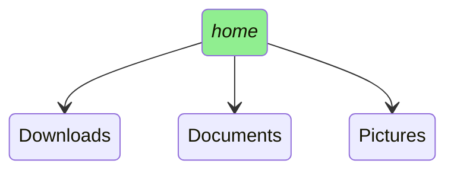
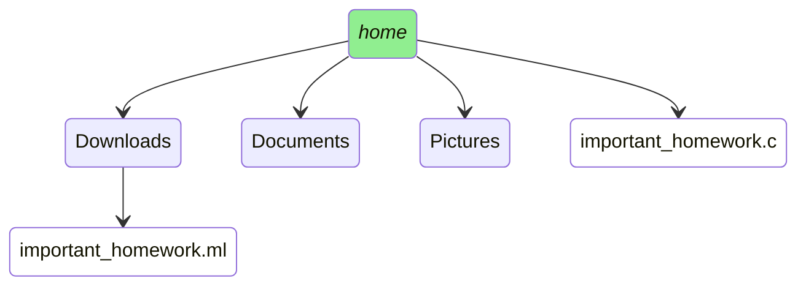
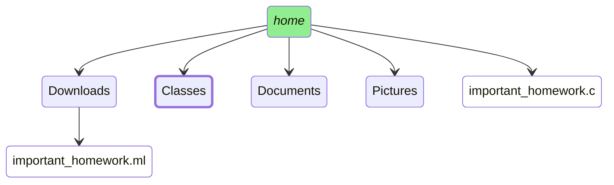
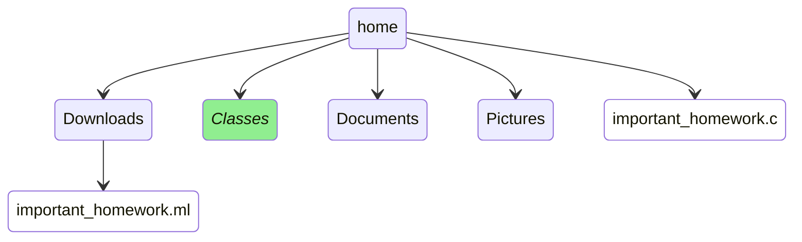
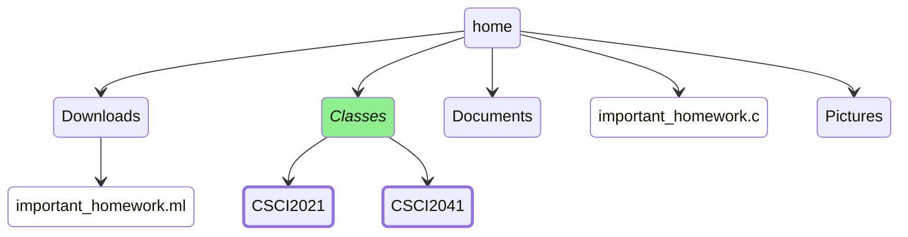
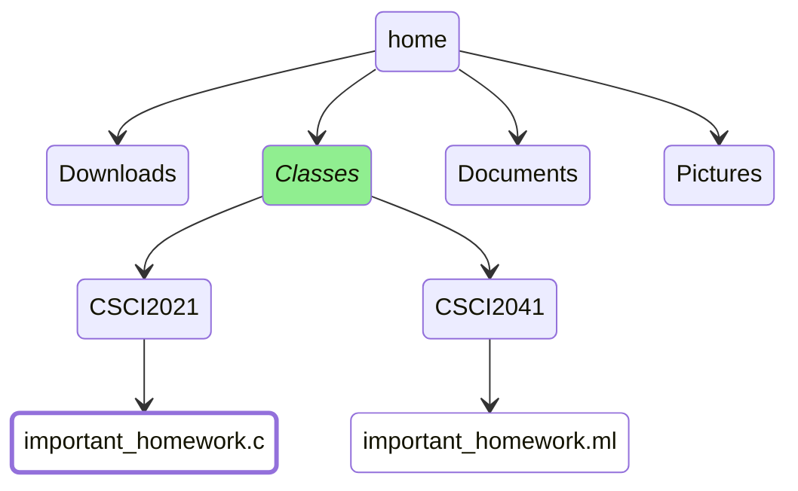
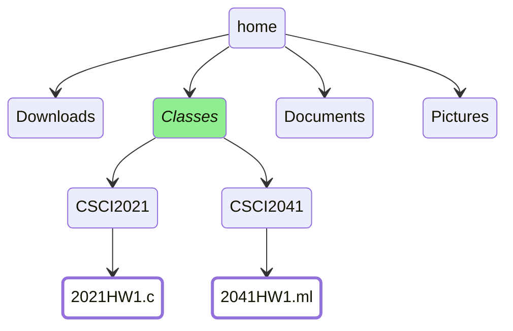

<!-- [[_toc_]] -->


# Introduction
If you have never worked with the command line, it can feel archaic and unintuitive,
especially when used to graphical interfaces, i.e, Windows file explorer. In the 
beginning it's a little like being placed in a city where you don't know language.


While I have found it to be is a useful skill in general, at the very least having 
a more concrete understanding of how you can traverse and manipulate the file 
tree will make your experiences with classes like machine architecture or 
operating systems *much* smoother.

The encouraging news is that only a handful of core commands 
form the backbone of most command line activities. My goal in this article
is to walk through a practical example with visual aids that will hopefully
shed light on what is happening under the surface.


#### The File Tree

When you open up a new terminal you will find yourselfin your home directory, which 
you can think of the root of a tree, - specifically, the file tree.

The file tree is made up of two components: directories
and files. Directories can contain other directories or files, creating a 
hierarchical structure. 

Let's visualize a simplified file tree.

---
*In our visualization, green indicates the current directory, blue represents other directories, and white denotes files.*

---


We can explore this structure textually using the **ls** command

#### ls
```
> ls 
Documents  
Downloads  
Pictures
```
The **ls** command displays the contents(both directories and files) of the 
specified directory, or the current directory if no argument is given
  
### Practical Demonstration
    
Imagine, afger a week into the semester, my filesystem looks a bit disorganized[j
___
  

___

I have completed homework for both my CSCI2021 and 
CSCI2041 classes, but for some reason my 2041 homework is in the Downloads 
directory and my 2021 homework is in the home directory.

While this might be manageable now, it coulc become cumbersome to locate files
later. I decide to create a Classes directory, organizing each class into its 
own subdirectory


#### Creating Directories with *'mdkir'*
To start off, I utilize the command **mkdir** to create a new directory.

```
> mkdir Classes
```

No output here typically indicates success.

Now, my filesystem should look something like this:

___
  

___

I can try confirming this using **ls**:

```
> ls 
Documents  
Downloads  
Pictures
Classes
important_homework.c

```

Also, notice how important_homework.ml does not show up, **ls** only shows items
in the current directory.


To look inside the Downloads directory I could specify it in the ls command:
```
> ls Downloads
important_homework.ml
```

### Navigating the File Tree

I can move into my shiny new directory using the **cd** command(change directory).

```
> cd classes
```

___
  

___


#### Understanding Paths
A directory or files **path** is the series of directories you must navigate 
through to reach it, starting from your current directory(relative path)
or the home directory(absolute path)

Upon entering the Classes directory, it's disconnected from Downloads, making a 
direct ls Downloads command ineffective. Instead, we'd use the absolute path:

```
> ls /home/Downloads 
important_homework.ml
```
A handy shortcut, '~', represensts your home directory, making 

```
cd ~
```
a convenient way to return home.


If you get lost, **pwd**(present working directory), shows your current
location the file tree.

```
> pwd
/home/Classes
```

Continuing with organization, I aim to create individual directories for each
class within Classes using mkdir again:

```
> mkdir CSCI2021  
> mkdir CSCI2041
```


#### mv
___
  


___


Now, I want to move important_homework.ml from Downloads to CSCI2041 and 
important_homework.c from the home directory to CSCI2021.

*Using Absolute Paths to Move Files*

The mv command not only moves files but can also rename them. 
To move files across directories that aren't directly connected, we'll use absolute paths.

Starting with moving important_homework.ml to CSCI2041:


```
> mv ~/Downloads/important_homework.ml ~/Classes/CSCI2041
```

Then, moving important_homework.c CSCI2021:

```
> mv ~/Downloads/important_homework.ml ~/Classes/CSCI2021"
```
After these operations, our filesystem should reflect the changes:


---

---

  
Finally, to make the files more identifiable, I'll rename them to reflect their class and assignment number.

Renaming important_homework.ml to 2041HW1.ml:
```
> mv ~/Classes/CSCI2041/important_homework.ml ~/Classes/CSCI2041/2041HW1.ml
```

Renaming important_homework.c to 2021HW1.ml:
```
> mv ~/Classes/CSCI2021/important_homework.c ~/Classes/CSCI2021/2021HW1.c
```

note you could also use relative paths, which can save a lot of typing:
```
> mv CSCI2021/important_homework.c CSCI2021/2021HW1.c
> mv CSCI2041/important_homework.c CSCI2041/2024HW1.c
```


#### Conclusion
While this example does not show off everything possible on the command line,
hopefully it makes jumping in a little less daunting. Below I have included, 
some other commands you will likely use on your journey, but I encourage you 
to seek out other resources to enrich your command line experience.

## Other Useful Commands/Tricks
+ touch <file_name> <destination>- Creates an empty file at destination with the given name
+ rm <file_name or directory> - Deletes files or empty directories.
   + rm -r <directory> - will recursively delete everything in directory, so be careful
   if you use it
+ cp <file_name or directory> <destination> - copies files or directory(needs the -r flag)
+ clear - clears the terminal screen


  

